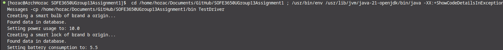

## File Structure

This java project follows the typical no build tools file structure. 

##### bin 
bin contains compiled .class and anything else that gets compiled. For neatness, up to date compiled code, and ease of upload, .class files are included in the .gitignore file. 

##### lib
lib contains the would be dependencies for the project that come in the form of JAR files.

##### src
src contains all of the source code that makes the project function.

## Testing and Method Descriptions

The test methods developed are located within BrandAFactory.java and the brand b equivalent.

##### createSmartBulb()
Overridden method from the interface SmartDeviceFactory.java that creates a smart bulb from whichever brand the factory is from.

##### createSmartLock()
Overridden method from the interface SmartDeviceFactory.java that creates a smart lock from whichever brand the factory is from.

##### setPowerUsage()
Located within Brand SmartBulb.java for brand a and b, it sets the power usage of the smart bulb by looking up the values in a database, which we used Database.txt to simulate. We use BufferedReader along with FileReader to get the file and read line by line, searching for that brand's bulb entry and setting it if found.

##### setBatteryConsumption()
Functions the same as setPowerUsage() but is made for smart locks instead.

##### main(String[] args)
We put the main function to be run in TestDriver in order to create both factories and test them by creating a bulb from brand a and a lock from brand b. There are System.out.println functions spread throughout for visibility on the terminal end.

Here is the output from TestDriver.java:
